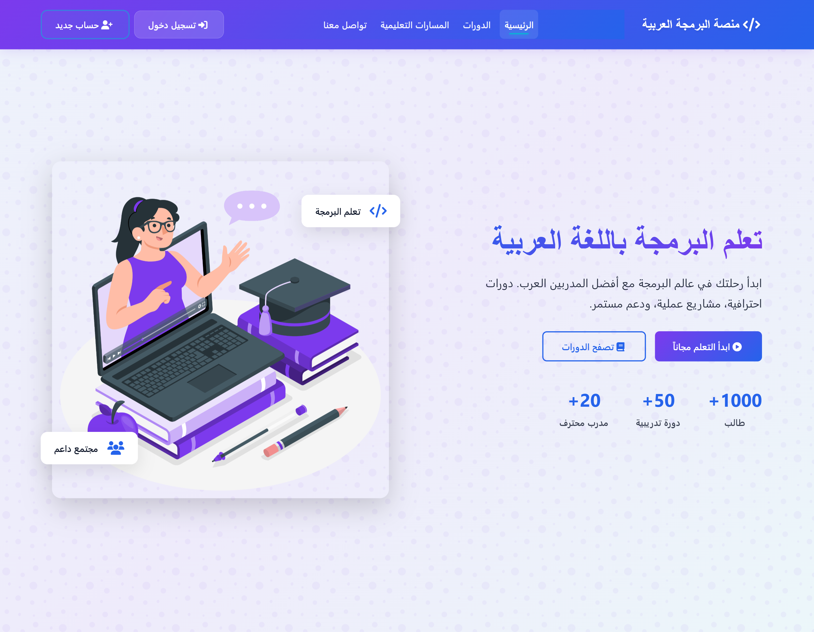
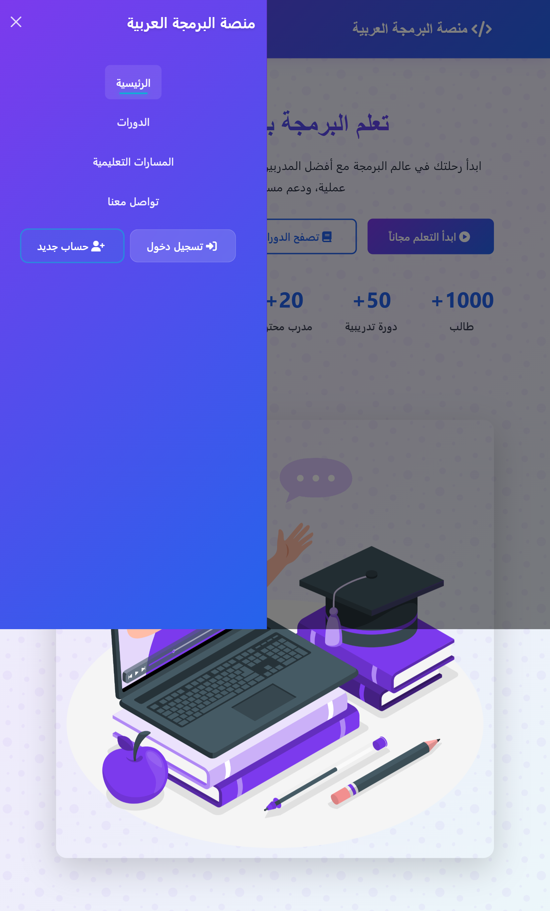

# Arabic Programming Academy 🚀
A comprehensive Arabic educational platform dedicated to teaching programming and technology skills to Arabic-speaking learners.

  
  
  
  
  

## Overview

Arabic Programming Academy is a responsive web platform designed to provide high-quality programming education in Arabic. The platform aims to bridge the knowledge gap and make technology education more accessible to Arabic-speaking communities.

## 📅 Project Timeline

**Initial Version – June 2023**  
- First UI-only prototype design  
- Basic layout structure built using Bootstrap  
- RTL (Right-to-Left) Arabic interface support setup  

**First Public Release – May 25, 2024**  
- Official launch of the responsive dashboard  
- Completion of core UI components  
- Integration of essential features  

**Major Update – December 2024**  
- Improved mobile-first responsiveness  
- Added interactive elements (e.g., menus, cards)  
- Performance enhancements and faster load times  
- Refined overall user experience and visual design  

**Latest Update – July 2025**  
- UI/UX refinements based on user feedback  
- Fixed cross-browser rendering and compatibility issues  
- More stable release with general bug fixes  
- Continued optimization for better performance  

## Technologies Used

- **Frontend Framework:**
  - Bootstrap 5
  - HTML5
  - CSS3
  - JavaScript

- **Responsive Design:**
  - Mobile-first approach
  - Flexible grid system
  - Custom media queries

- **Additional Features:**
  - Custom Arabic UI/UX design
  - RTL (Right-to-Left) support
  - Modern and clean interface

## Screenshots

### Desktop View

### Mobile Views

<table>
  <tr>
    <td align="center">
      
       Mobile View 1
    </td>
    <td align="center">
      
       Mobile View 2
    </td>
  </tr>
</table>

## Features

- Responsive navigation system
- Interactive course catalog
- User-friendly interface
- Arabic-first content structure
- Modern design elements
- Cross-browser compatibility

## Browser Support

- Chrome (latest)
- Firefox (latest)
- Safari (latest)
- Edge (latest)
- Opera (latest)

## Installation

1. Clone the repository
2. Open index.html in your browser
3. No additional setup required

## Contributing

Contributions are welcome! Please feel free to submit a Pull Request.

## License

This project is licensed under the MIT License - see the LICENSE file for details.
